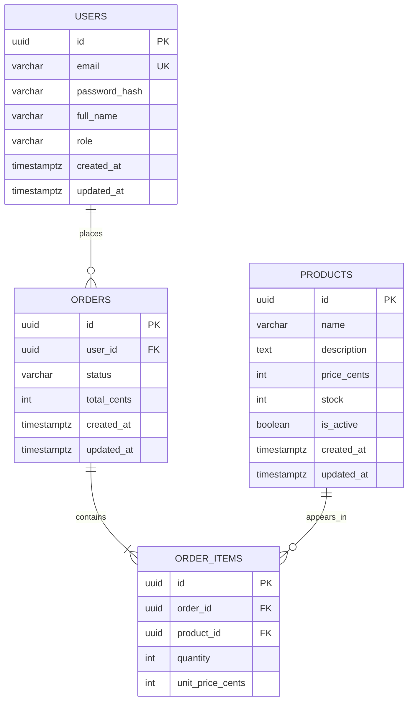

# Modelo de datos

```mermaid
erDiagram
  USERS ||--o{ ORDERS : places
  ORDERS ||--|{ ORDER_ITEMS : contains
  PRODUCTS ||--o{ ORDER_ITEMS : appears_in

  USERS {
    uuid id PK
    varchar email UK
    varchar password_hash
    varchar full_name
    varchar role
    timestamptz created_at
    timestamptz updated_at
  }
  PRODUCTS {
    uuid id PK
    varchar name
    text description
    int price_cents
    int stock
    boolean is_active
    timestamptz created_at
    timestamptz updated_at
  }
  ORDERS {
    uuid id PK
    uuid user_id FK
    varchar status
    int total_cents
    timestamptz created_at
    timestamptz updated_at
  }
  ORDER_ITEMS {
    uuid id PK
    uuid order_id FK
    uuid product_id FK
    int quantity
    int unit_price_cents
  }
```